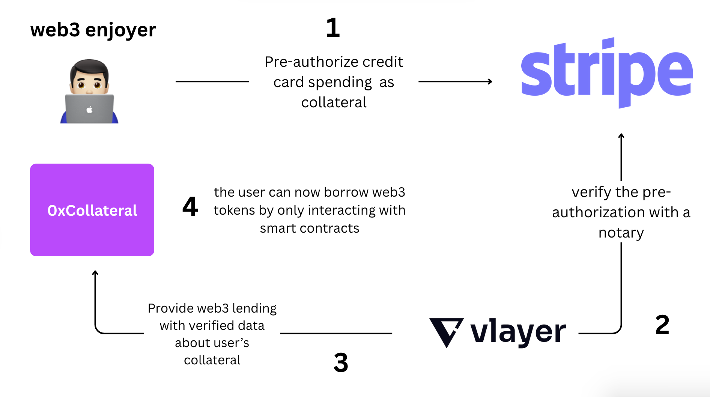

# 0xCollateral

<h3><em>Anonymous and permissionless use of your Web2 creditworthiness to borrow Web3 assets.</em></h3>

## 🏆 Awards & Recognition

### ETH Global Prague 2025
**Finalist**

### 🥇 Vlayer Award
**Most Inspiring Use of Vlayer Superpowers**  
`$4000 USDC`

---

## 🎬 Project Showcase

  
  
<i>Click to watch our ETH Global Prague presentation</i>

  <table>
    <tr>
      <td width="50%">
        
        
<i>User Interface</i>

      </td>
      <td width="50%">
        
        
<i>Process Flow</i>

      </td>
    </tr>
  </table>

## The Problem
Since the advent of DeFi, one core problem has remained unsolved:
There's been no way to take out a true Web3 loan. To borrow Web3 assets, users have always had to lock up their own crypto—often overcollateralizing their positions.

## Our Solution
We've found a way to leverage your Web2 creditworthiness to enable Web3-native loans—without KYC, without identity checks, and with a fully permissionless experience.

**The value proposition is clear:**
- Traditional credit power, now usable in DeFi.
- Seamless bridge between Web2 financial data and Web3 protocols.

**Vlayer: The Critical Bridge**
At the core of our product is Vlayer, which acts as the essential bridge for verified financial data from Stripe to the Web3 world. This trustless notarization system makes the entire concept possible - without these verifications, connecting traditional finance to DeFi would remain impossible.

0xCollateral lets users use their Web2 credit cards as collateral to borrow Web3 tokens — without KYC, in a trustless and smart-contract-only environment.

We combine Stripe, Vlayer (for notarization), and on-chain contracts to make borrowing accessible, private, and overcollateralized using real-world financial credibility.

# 🔄 How It Works
User pre-authorizes a credit card (via Stripe) as a spending limit/collateral.

Vlayer notarizes and verifies this pre-authorization, cryptographically proving the collateral exists.

This verified data is sent to 0xCollateral smart contracts, enabling lending.

User can now borrow Web3 tokens directly, anonymously, and permissionlessly, using only smart contracts.

# 💡 Why It Matters
In traditional DeFi, you need more crypto than you borrow. We flip that.

With 0xCollateral, users can:

Use Web2 financial data without doxxing themselves.

Stay fully anon — no KYC, no accounts.

Tap into DeFi liquidity using their creditworthiness.

All backed by notarized proof, not trust.

# 📦 Tech Stack
Stripe – Credit card pre-auth

Vlayer – Trustless notarization of Web2 data

Smart Contracts (Solidity) – Lending logic, collateral verification

# 🔐 No Identity. Just Collateral.
To make a Web3 loan, don’t reveal yourself. Just prove you can pay.

# 👥 Contributors

  <table>
    <tr>
      <td align="center">
        <a href="https://github.com/justincanto">
          
           
          <b>Justin Canto</b>
        </a>
      </td>
      <td align="center">
        <a href="https://github.com/stupside">
          
           
          <b>Kilian Houpeurt</b>
        </a>
      </td>
      <td align="center">
        <a href="https://github.com/luaroncrew">
          
           
          <b>Kirill Makarov</b>
        </a>
      </td>
    </tr>
  </table>

